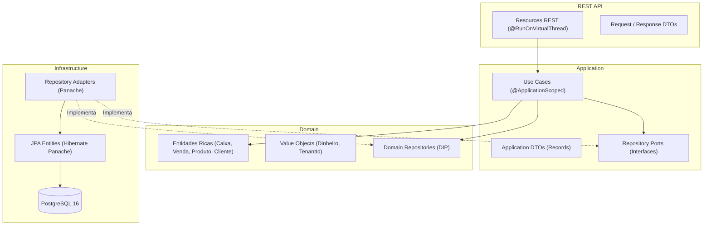

# 🛒 Mercado API

> Backend moderno, escalável e robusto para **Ponto de Venda (PDV), Gestão Comercial e Estoque**, construído com **Java 21**, **Quarkus 3** e os princípios rigorosos da **Clean Architecture** e **Domain-Driven Design (DDD)**.


---

## 📌 Visão Geral

O **Mercado API** foi desenvolvido para atender com excelência às operações diárias de mercados, mercearias e atacarejos. Utiliza o poder das **Virtual Threads do Java 21** para entregar altíssimo throughput sob concorrência intensa, além de suporte nativo a **Multi-tenancy** (cada loja opera com isolamento estrito via cabeçalho `X-Tenant-Id`).

---

## 🚀 Módulos e Funcionalidades

### 1. Ponto de Venda (PDV) & Vendas com Carrinho
* Registro de vendas diretas ou com itens de carrinho detalhados (`quantidade`, `precoUnitario`, `subtotal`).
* Baixa automática e atômica de saldo no catálogo de produtos.
* Múltiplas formas de pagamento: `DINHEIRO`, `PIX`, `CARTAO` e `FIADO`.
* Validação de troco, incremento da gaveta física e vínculo com o caixa aberto.

### 2. Cancelamento e Estorno de Vendas
* Histórico cronológico das vendas registradas no caixa atualmente aberto.
* Cancelamento transacional com justificativa obrigatória.
* **Estorno financeiro automático:**
  * Vendas em `DINHEIRO` estornam e abatem o valor diretamente do saldo da gaveta do caixa.
  * Vendas em `FIADO` abatem o saldo devedor na conta corrente do cliente.
  * Reposição automática de estoque de todos os produtos do pedido cancelado.
* Bloqueio estrito de estorno caso o caixa já se encontre encerrado.

### 3. Gestão e Controle de Caixa
* Abertura de caixa com fundo de troco (saldo inicial).
* Movimentações operacionais avulsas: **Sangria** (retirada) e **Suprimento** (reforço de troco).
* Resumo consolidado do caixa aberto em tempo real (totais por forma de pagamento, sangrias e suprimentos).
* Fechamento de caixa com cálculo automatizado de diferenças entre valor apurado e valor conferido.

### 4. Gestão e Amortização de Fiado
* Cadastro e busca ágil de clientes por nome ou telefone.
* Controle de limite de crédito e saldo devedor individual.
* Amortização parcial ou total de dívidas com entrada automática na gaveta de dinheiro caso paga em espécie.

### 5. Catálogo Gerencial e Controle de Estoque
* Gestão completa de produtos com `categoria`, `precoVenda`, `precoCusto` e `estoqueMinimo`.
* Filtros dinâmicos: busca textual por nome, filtro por categoria e flag de alerta de estoque baixo.
* Ajuste manual de estoque físico para acertos de inventário e contagem de prateleira com justificativa.
* Alternância rápida de status ativo/inativo no catálogo.

### 6. Dashboard Gerencial e Métricas Comerciais
* Consultas agregadas de alta performance no banco sem carregar registros em memória.
* Métricas do dia (00:00:00 até o momento) e do mês corrente: faturamento total, quantidade de vendas e ticket médio.
* Total de **Fiado na Rua** (soma consolidada de todos os clientes com saldo devedor ativo).
* Distribuição percentual e absoluta das vendas do dia por forma de pagamento.
* Ranking dos **Top 5 produtos mais vendidos** do mês por faturamento e volume.

### 7. Extrato Detalhado e Linha do Tempo do Fiado
* Extrato cronológico unificado por cliente integrando compras a prazo (`COMPRA_FIADO`) e pagamentos parciais (`AMORTIZACAO`).
* Apresentação da data/hora, forma de pagamento, lista de itens comprados e recálculo progressivo do saldo devedor.

### 8. Controle de Permissões por PIN de Gerente
* Camada de autorização para operações sensíveis de caixa e PDV.
* Exigência de cabeçalho `X-Gerente-Pin` em cancelamento de vendas e retiradas por sangria.
* Armazenamento seguro de senhas com algoritmo de hashing **BCrypt**.
* Endpoints dedicados para conferência e alteração de PIN administrativo por tenant.

---

## 🏛️ Arquitetura e Padrões de Projeto

O projeto segue os princípios de **Clean Architecture**, **Domain-Driven Design (DDD)** e **SOLID**:



### Estrutura de Pacotes

```text
com.mercado
├── domain/                      # Núcleo puro de negócio (independente de frameworks)
│   ├── entity/                  # Entidades ricas: Caixa, Cliente, Produto, Venda, ItemVenda, etc.
│   ├── valueobject/             # Value Objects imutáveis: Dinheiro, TenantId
│   ├── repository/              # Interfaces puras de persistência de domínio (DIP)
│   └── exception/               # Hierarquia de exceções do domínio (DomainException)
├── application/                 # Orquestração dos casos de uso
│   ├── usecase/                 # RegistrarVenda, CancelarVenda, SalvarProduto, Dashboard, etc.
│   ├── dto/                     # Records de entrada/saída desacoplados do protocolo HTTP
│   └── repository/              # Ports analíticos da camada de aplicação (ex: DashboardRepository)
├── infrastructure/              # Adapters de infraestrutura e persistência
│   └── persistence/
│       ├── entity/              # Entidades Panache JPA mapeadas no PostgreSQL
│       └── repository/          # Implementações dos repositórios com queries otimizadas
└── api/                         # Adaptadores de entrada REST (JAX-RS)
    ├── resource/                # VendaResource, ProdutoResource, CaixaResource, DashboardResource
    ├── dto/                     # Payloads de Request e Response (Jackson)
    └── handler/                 # Exception Mappers globais com status HTTP padronizados
```

---

## 🛠️ Tecnologias Utilizadas

| Tecnologia | Finalidade |
| :--- | :--- |
| **Java 21** | Records, Pattern Matching, Switch Expressions e Virtual Threads nativas |
| **Quarkus 3** | Framework Java supersônico de baixíssimo consumo de memória |
| **SmallRye Virtual Threads** | Execução de I/O não-bloqueante via `@RunOnVirtualThread` |
| **Hibernate Panache** | Produtividade e queries de alta performance sobre JPA/Hibernate |
| **PostgreSQL 16** | Banco relacional com campos numéricos de alta precisão e chaves UUID |
| **Flyway** | Versionamento incremental do banco de dados (V1 a V5) |
| **Docker & Docker Compose** | Infraestrutura rápida para desenvolvimento e produção |
| **JUnit 5** | Testes unitários de domínio e aplicação com fakes em memória |

---

## ⚙️ Como Executar

### Pré-requisitos
* **Java 21** instalado (`java -version`)
* **Docker** e **Docker Compose** instalados
* **Git**

---

### 1. Clonar o Repositório

```bash
git clone https://github.com/SEU_USUARIO/mercado-api.git
cd mercado-api
```

---

### 2. Subir o Banco de Dados

Inicie a instância PostgreSQL com as extensões necessárias:

```bash
docker compose up -d
```

> **Parâmetros de Conexão:**
> * Porta: `5433` (mapeada para evitar conflito com instâncias locais na 5432)
> * Database: `mercado_db`
> * Usuário: `postgres` / Senha: `postgrespassword`

---

### 3. Rodar a Aplicação

O Quarkus possui suporte a **Live Reload** instantâneo:

```bash
# Windows
.\gradlew.bat quarkusDev

# Linux / macOS
./gradlew quarkusDev
```

* **API Base:** `http://localhost:8080`  
* **Dev UI do Quarkus:** `http://localhost:8080/q/dev/`

---

### 4. Executar os Testes

```bash
# Windows
.\gradlew.bat test

# Linux / macOS
./gradlew test
```

---

## 🗄️ Histórico de Migrações (Flyway)

| Versão | Descrição |
| :--- | :--- |
| **`V1__criar_tabelas_iniciais.sql`** | Criação de `tenants`, `caixas`, `clientes` e `vendas`. |
| **`V2__criar_movimentacoes_caixa.sql`** | Tabela `movimentacoes_caixa` para sangrias e suprimentos. |
| **`V3__criar_produtos_e_itens_venda.sql`** | Catálogo `produtos` e relação de `itens_venda`. |
| **`V4__adicionar_cancelamento_venda.sql`** | Campos de status, motivo, data de cancelamento e vínculo de cliente em `vendas`. |
| **`V5__evoluir_tabela_produtos.sql`** | Colunas `categoria`, `preco_custo` e `estoque_minimo` com índices de consulta. |
| **`V6__criar_tabela_amortizacoes.sql`** | Tabela `amortizacoes` para pagamentos parciais de clientes com vínculo de caixa. |
| **`V7__adicionar_pin_gerente_tenant.sql`** | Coluna `pin_gerente` em `tenants` com hash BCrypt padrão para PIN '1234'. |

---

## 📖 Documentação da API REST

> 💡 **Cabeçalho Obrigatório:**  
> Todas as requisições privadas exigem o identificador da loja inquilina:  
> **`X-Tenant-Id: 00000000-0000-0000-0000-000000000001`**

---

### 🛒 1. Vendas & PDV

#### Registrar Venda (com ou sem itens)
* **`POST /api/vendas`**
* **Request:**
```json
{
  "formaPagamento": "DINHEIRO",
  "valorTotal": 37.00,
  "valorRecebido": 50.00,
  "descricao": "Compra no caixa",
  "itens": [
    {
      "produtoId": "a1b2c3d4-e5f6-7a8b-9c0d-1e2f3a4b5c6d",
      "descricao": "Café Torrado 500g",
      "quantidade": 2.000,
      "precoUnitario": 18.50
    }
  ]
}
```
* **Response (201 Created):**
```json
{
  "vendaId": "9b1deb4d-3b7d-4bad-9bdd-2b0d7b3dcb6d",
  "valorTotal": 37.00,
  "troco": 13.00,
  "saldoDevedorCliente": null
}
```

#### Listar Vendas do Caixa Atual
* **`GET /api/vendas/caixa-atual`**
* **Response (200 OK):**
```json
[
  {
    "id": "9b1deb4d-3b7d-4bad-9bdd-2b0d7b3dcb6d",
    "valorTotal": 37.00,
    "formaPagamento": "DINHEIRO",
    "status": "CONCLUIDA",
    "criadoEm": "2026-09-06T14:30:00Z",
    "nomeCliente": null,
    "totalItens": 1
  }
]
```

#### Cancelar e Estornar Venda
* **`POST /api/vendas/{id}/cancelar`**
* **Request:**
```json
{
  "motivo": "Cliente desistiu da compra"
}
```
* **Response (200 OK):**
```json
{
  "vendaId": "9b1deb4d-3b7d-4bad-9bdd-2b0d7b3dcb6d",
  "status": "CANCELADA",
  "canceladaEm": "2026-09-06T14:35:10Z"
}
```

---

### 📦 2. Produtos & Estoque

| Método | Rota | Descrição |
| :--- | :--- | :--- |
| `GET` | `/api/produtos` | Lista produtos gerencialmente (`?busca=...&categoria=...&estoqueBaixo=true`) |
| `GET` | `/api/produtos/{id}` | Obtém detalhes de um produto |
| `POST` | `/api/produtos` | Cadastra novo produto |
| `PUT` | `/api/produtos/{id}` | Atualização cadastral completa |
| `PATCH` | `/api/produtos/{id}/estoque` | Ajuste manual do saldo físico de estoque |
| `PATCH` | `/api/produtos/{id}/status` | Alterna status entre ativo e inativo |

#### Exemplo: Cadastrar Produto (`POST /api/produtos`)
```json
{
  "nome": "Arroz Parboilizado 5kg",
  "categoria": "Mercearia",
  "precoVenda": 29.90,
  "precoCusto": 21.50,
  "unidade": "PCT",
  "estoqueInicial": 50.000,
  "estoqueMinimo": 10.000
}
```

#### Exemplo: Ajuste de Estoque (`PATCH /api/produtos/{id}/estoque`)
```json
{
  "novoEstoque": 42.000,
  "motivo": "Contagem física do inventário mensal"
}
```

---

### 💵 3. Gestão de Caixa

| Método | Rota | Descrição |
| :--- | :--- | :--- |
| `GET` | `/api/caixas/atual` | Resumo financeiro consolidado do caixa aberto |
| `POST` | `/api/caixas/abrir` | Abertura de caixa (`saldoInicial`) |
| `POST` | `/api/caixas/movimentacoes` | Registro de Sangria ou Suprimento (*Sangria requer `X-Gerente-Pin`*) |
| `POST` | `/api/caixas/fechar` | Fechamento do caixa com conferência de saldo |

---

### 👥 4. Clientes & Fiado

| Método | Rota | Descrição |
| :--- | :--- | :--- |
| `GET` | `/api/clientes` | Lista clientes com saldo devedor (`?busca=...`) |
| `GET` | `/api/clientes/{id}/extrato` | Extrato cronológico detalhado do fiado (compras e pagamentos) |
| `POST` | `/api/clientes/{id}/amortizacoes` | Amortiza débito fiado (`valorPago`, `formaPagamento`) |

---

### 📊 5. Dashboard Gerencial

* **Rotas:** `GET /dashboard/resumo` ou `GET /api/dashboard/resumo`
* **Response (200 OK):**
```json
{
  "hoje": {
    "faturamentoTotal": 1450.80,
    "totalVendas": 28,
    "ticketMedio": 51.81
  },
  "mesAtual": {
    "faturamentoTotal": 38920.50,
    "totalVendas": 745,
    "ticketMedio": 52.24
  },
  "totalFiadoNaRua": 2840.00,
  "distribuicaoPagamentosHoje": [
    {
      "formaPagamento": "DINHEIRO",
      "total": 650.00,
      "quantidade": 14,
      "percentual": 44.80
    },
    {
      "formaPagamento": "PIX",
      "total": 520.80,
      "quantidade": 9,
      "percentual": 35.90
    },
    {
      "formaPagamento": "CARTAO",
      "total": 280.00,
      "quantidade": 5,
      "percentual": 19.30
    }
  ],
  "topProdutosMes": [
    {
      "nomeProduto": "Café Torrado 500g",
      "quantidadeTotal": 120.000,
      "subtotalTotal": 2220.00
    },
    {
      "nomeProduto": "Arroz Parboilizado 5kg",
      "quantidadeTotal": 65.000,
      "subtotalTotal": 1943.50
    }
  ]
}
```

---

### 🔑 6. Segurança e Permissões por PIN

Endpoints para validação e configuração do PIN de Gerente (compatíveis com prefixos `/seguranca` e `/api/seguranca`):

| Método | Rota | Descrição |
| :--- | :--- | :--- |
| `POST` | `/api/seguranca/validar-pin` | Valida credencial numérica do gerente (`pin`) |
| `PUT` | `/api/seguranca/alterar-pin` | Altera o PIN do tenant (`pinAtual`, `novoPin` de 4 a 6 dígitos) |

> ⚠️ **Operações Protegidas por PIN:**
> * `POST /api/vendas/{id}/cancelar`: exige cabeçalho `X-Gerente-Pin`
> * `POST /api/caixas/movimentacoes` (apenas tipo `SANGRIA`): exige cabeçalho `X-Gerente-Pin`

---

## 🔒 Tratamento Padronizado de Erros

Erros do domínio e validações retornam payloads padronizados via [`DomainExceptionHandler`](file:///C:/Projetos%20pessoais/mercado/mercado-api/src/main/java/com/mercado/api/handler/DomainExceptionHandler.java):

```json
{
  "erro": "Regra de Negócio Violada",
  "mensagem": "Não é permitido estornar venda de um caixa já encerrado.",
  "status": 422,
  "timestamp": "2026-09-06T15:00:00"
}
```

| Código HTTP | Significado |
| :--- | :--- |
| **`400 Bad Request`** | Parâmetro inválido, UUID mal formatado ou cabeçalho `X-Tenant-Id` ausente |
| **`403 Forbidden`** | PIN de gerente incorreto ou ausente para operação sensível |
| **`404 Not Found`** | Recurso (produto, cliente, caixa ou venda) não encontrado |
| **`422 Unprocessable Entity`** | Regra de negócio violada (saldo insuficiente, valores negativos, etc.) |
| **`500 Internal Server Error`** | Falha técnica inesperada |

---

## 📄 Licença

Este projeto está sob a licença [MIT](LICENSE).
