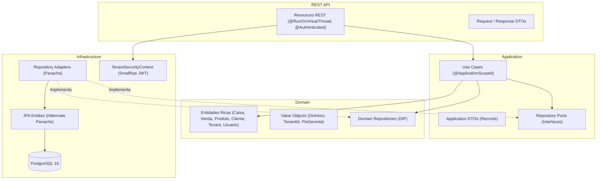

# 🛒 Mercado API

> Backend moderno, escalável e robusto para **Ponto de Venda (PDV), Gestão Comercial, Fiado e Estoque**, construído com **Java 21**, **Quarkus 3** e os princípios rigorosos da **Clean Architecture** e **Domain-Driven Design (DDD)**.


---

## 📌 Visão Geral

O **Mercado API** foi desenvolvido para atender com excelência às operações diárias de mercados, mercearias e atacarejos. Utiliza o poder das **Virtual Threads do Java 21** (`@RunOnVirtualThread`) para entregar altíssimo throughput sob concorrência intensa, além de suporte nativo a **Multi-tenancy** estrito e autenticação **JWT assinada com RS256**.

---

## 🚀 Módulos e Funcionalidades

### 1. Ponto de Venda (PDV) & Vendas com Carrinho
* Registro de vendas com itens de carrinho detalhados (`quantidade`, `precoUnitario`, `subtotal`) ou valor avulso.
* Baixa automática e atômica de saldo no catálogo de produtos.
* Múltiplas formas de pagamento: `DINHEIRO`, `PIX`, `CARTAO` e `FIADO`.
* Validação de troco, incremento da gaveta física e vínculo com o caixa aberto.

### 2. Cancelamento e Estorno de Vendas (Protegido por PIN)
* Histórico cronológico das vendas registradas no caixa atualmente aberto.
* Cancelamento transacional com justificativa obrigatória e autorização por **PIN de Gerente**.
* **Estorno financeiro automático:**
  * Vendas em `DINHEIRO` estornam e abatem o valor diretamente do saldo da gaveta do caixa.
  * Vendas em `FIADO` abatem o saldo devedor na conta corrente do cliente.
  * Reposição automática de estoque de todos os produtos do pedido cancelado.
* Bloqueio estrito de estorno caso o caixa já se encontre encerrado.

### 3. Gestão e Controle de Caixa
* Abertura de caixa com fundo de troco (saldo inicial).
* Movimentações operacionais avulsas: **Sangria** (retirada protegida por PIN) e **Suprimento** (reforço de troco).
* Resumo consolidado do caixa aberto em tempo real (totais por forma de pagamento, sangrias e suprimentos).
* Fechamento de caixa com cálculo automatizado de diferenças entre valor apurado e valor conferido.

### 4. Gestão de Clientes, Fiado e Cobrança
* Cadastro completo de clientes com `apelido`, `cpf`, `telefone`, `endereco`, `limiteCredito` e `diaVencimento`.
* Bloqueio administrativo de compras a prazo com justificativa.
* Amortização parcial ou total de débitos com entrada automática na gaveta de dinheiro caso paga em espécie.
* Extrato cronológico unificado (`COMPRA_FIADO` e `AMORTIZACAO`) com recálculo progressivo do saldo devedor.
* Exclusão de cliente protegida por PIN (com trava impedindo exclusão de clientes com débitos pendentes).

### 5. Catálogo Gerencial, Categorias e Controle de Estoque
* Gestão completa de produtos com `categoria`, `precoVenda`, `precoCusto`, `unidade` e `estoqueMinimo`.
* Gestão de **Categorias de Produtos customizadas por loja** com ícones temáticos.
* Filtros dinâmicos: busca textual por nome, filtro por categoria e flag de alerta de estoque baixo.
* Ajuste manual de estoque físico para acertos de inventário e contagem de prateleira com justificativa.
* Alternância rápida de status ativo/inativo no catálogo.

### 6. Dashboard Gerencial e Métricas Comerciais
* Consultas agregadas de alta performance no banco sem carregar registros em memória.
* Métricas do dia (00:00:00 até o momento) e do mês corrente: faturamento total, quantidade de vendas e ticket médio.
* Total de **Fiado na Rua** (soma consolidada de todos os clientes com saldo devedor ativo).
* Distribuição percentual e absoluta das vendas do dia por forma de pagamento.
* Ranking dos **Top 5 produtos mais vendidos** do mês por faturamento e volume.

### 7. Autenticação JWT e Multi-Tenancy Inteligente
* Autenticação Stateless via **SmallRye JWT / MicroProfile** com chaves assimétricas **RSA (RS256)**.
* Login multi-tenant inteligente por `login` e `senha` com identificação automática do `tenant_id` real.
* Extração segura do `tenant_id` diretamente das claims do JWT (`TenantSecurityContext`), garantindo isolamento absoluto de dados.
* Suporte a perfis de acesso: `GERENTE` e `OPERADOR`.

### 8. Onboarding Automático de Estabelecimentos
* Registro de novos mercados em fluxo único via `POST /api/onboarding`.
* Criação atômica do Tenant, Administrador com perfil `GERENTE`, semente de 7 categorias padrão e emissão do JWT inicial.

### 9. Controle de Permissões por PIN de Gerente
* Camada de autorização para operações críticas (`cancelamento de venda`, `sangria de gaveta`, `exclusão de cliente`).
* Suporte a envio de PIN via cabeçalho HTTP `X-Gerente-Pin` ou corpo JSON `pin`.
* Armazenamento seguro de senhas e PINs com algoritmo **BCrypt (custo 12)**.
* Endpoints dedicados para conferência e alteração de PIN administrativo.

---

## 🏛️ Arquitetura e Padrões de Projeto

O projeto segue os princípios de **Clean Architecture**, **Domain-Driven Design (DDD)** e **SOLID**:



### Estrutura de Pacotes

```text
com.mercado
├── domain/                      # Núcleo puro de negócio (independente de frameworks)
│   ├── entity/                  # Entidades ricas: Caixa, Cliente, Produto, Venda, ItemVenda, Tenant, Usuario, CategoriaProduto
│   ├── valueobject/             # Value Objects imutáveis: Dinheiro, TenantId, PinGerente
│   ├── repository/              # Interfaces puras de persistência de domínio (DIP)
│   └── exception/               # Hierarquia de exceções do domínio (DomainException)
├── application/                 # Orquestração dos casos de uso
│   ├── usecase/                 # RegistrarVenda, CancelarVenda, SalvarProduto, AutenticarUsuario, Onboarding, etc.
│   ├── dto/                     # Records de entrada/saída desacoplados do protocolo HTTP
│   └── repository/              # Ports analíticos da camada de aplicação (ex: DashboardRepository)
├── infrastructure/              # Adapters de infraestrutura, persistência e segurança
│   ├── persistence/
│   │   ├── entity/              # Entidades Panache JPA mapeadas no PostgreSQL
│   │   └── repository/          # Implementações dos repositórios com queries otimizadas
│   └── security/                # TenantSecurityContext (extração de claims JWT)
└── api/                         # Adaptadores de entrada REST (JAX-RS)
    ├── resource/                # VendaResource, ProdutoResource, CaixaResource, ClienteResource, AuthResource, etc.
    ├── dto/                     # Payloads de Request e Response (Jackson)
    └── handler/                 # DomainExceptionHandler global com status HTTP padronizados
```

---

## 🛠️ Tecnologias Utilizadas

| Tecnologia | Finalidade |
| :--- | :--- |
| **Java 21** | Records, Pattern Matching, Switch Expressions e Virtual Threads nativas |
| **Quarkus 3** | Framework Java supersônico de baixíssimo consumo de memória |
| **SmallRye JWT** | Autenticação stateless via MicroProfile JWT (RS256) |
| **SmallRye Virtual Threads** | Execução de I/O não-bloqueante via `@RunOnVirtualThread` |
| **Hibernate Panache** | Produtividade e queries de alta performance sobre JPA/Hibernate |
| **PostgreSQL 16** | Banco relacional com campos numéricos de alta precisão e chaves UUID |
| **Flyway** | Versionamento e migrações incrementais do banco de dados (V1 a V11) |
| **BCrypt (jBCrypt)** | Hashing criptográfico de senhas e PINs com custo 12 |
| **Docker & Docker Compose** | Infraestrutura rápida para desenvolvimento e produção |
| **JUnit 5** | Testes unitários e de integração de domínio e aplicação |

---

## ⚙️ Como Executar

### Pré-requisitos
* **Java 21** instalado (`java -version`)
* **Docker** e **Docker Compose** instalados
* **Git**

---

### 1. Clonar o Repositório

```bash
git clone https://github.com/SEU_USUARIO/mercado-api.git
cd mercado-api
```

---

### 2. Subir o Banco de Dados

Inicie a instância PostgreSQL com as extensões necessárias:

```bash
docker compose up -d
```

> **Parâmetros de Conexão:**
> * Porta: `5433` (mapeada para evitar conflito com instâncias locais na 5432)
> * Database: `mercado_db`
> * Usuário: `postgres` / Senha: `postgrespassword`

---

### 3. Rodar a Aplicação

O Quarkus possui suporte a **Live Reload** instantâneo:

```bash
# Windows
.\gradlew.bat quarkusDev

# Linux / macOS
./gradlew quarkusDev
```

* **API Base:** `http://localhost:8080`  
* **Dev UI do Quarkus:** `http://localhost:8080/q/dev/`

---

### 4. Executar os Testes

```bash
# Windows
.\gradlew.bat test

# Linux / macOS
./gradlew test
```

---

## 🗄️ Histórico de Migrações (Flyway)

| Versão | Descrição |
| :--- | :--- |
| **`V1__init_schema.sql`** | Criação das tabelas iniciais: `tenants`, `caixas`, `clientes` e `vendas`. |
| **`V2__criar_movimentacoes_caixa.sql`** | Tabela `movimentacoes_caixa` para sangrias e suprimentos. |
| **`V3__criar_produtos_e_itens_venda.sql`** | Catálogo `produtos` e relação de `itens_venda`. |
| **`V4__adicionar_cancelamento_venda.sql`** | Campos de status, motivo, data de cancelamento e vínculo de cliente em `vendas`. |
| **`V5__evoluir_tabela_produtos.sql`** | Colunas `categoria`, `preco_custo` e `estoque_minimo` com índices de consulta. |
| **`V6__criar_tabela_amortizacoes.sql`** | Tabela `amortizacoes` para pagamentos parciais de clientes com vínculo de caixa. |
| **`V7__adicionar_pin_gerente_tenant.sql`** | Coluna `pin_gerente` em `tenants` com suporte a autenticação por PIN. |
| **`V8__criar_tabela_usuarios.sql`** | Tabela `usuarios` com suporte a perfis `GERENTE`/`OPERADOR` e senhas em BCrypt. |
| **`V9__evoluir_cadastro_clientes.sql`** | Campos `apelido`, `cpf`, `endereco`, `dia_vencimento` e `status` (*ATIVO/BLOQUEADO*). |
| **`V10__criar_categorias_produto.sql`** | Tabela `categorias_produto` para categorias customizadas por tenant e seed inicial. |
| **`V11__corrigir_pin_gerente_padrao.sql`** | Atualização do hash BCrypt do PIN padrão `'1234'` para todos os tenants. |
| **`V12__adicionar_controle_licenca_tenant.sql`** | Colunas `status` (*ATIVO/PENDENTE/BLOQUEADO*), `data_expiracao_licenca` e `whatsapp` em `tenants`. |

---

## 📖 Documentação da API REST

> 🔐 **Autenticação JWT:**  
> A maioria das rotas exige o token de autorização via cabeçalho HTTP:  
> **`Authorization: Bearer <seu_token_jwt>`**  
> *(O `tenant_id` é resolvido automaticamente a partir das claims do token)*.

---

### 🔑 1. Autenticação, Onboarding & Auto-cadastro

| Método | Rota | Descrição | Acesso |
| :--- | :--- | :--- | :--- |
| `POST` | `/api/auth/login` | Autentica operador/gerente por login e senha | **Público** (`@PermitAll`) |
| `POST` | `/api/auth/cadastrar-comercio` | Auto-cadastro público de novo comércio (status `PENDENTE`) | **Público** (`@PermitAll`) |
| `GET` | `/api/auth/me` | Retorna dados do usuário autenticado no JWT | Protegido (`@Authenticated`) |
| `POST` | `/api/onboarding` | Cadastra novo mercado, administrador e categorias | **Público** (`@PermitAll`) |

#### Exemplo de Login (`POST /api/auth/login`)
```json
{
  "login": "admin",
  "senha": "suasenha"
}
```
*Response (200 OK):*
```json
{
  "token": "eyJ0eXAiOiJKV1QiLCJhbGciOiJSUzI1NiJ9...",
  "nome": "Administrador",
  "perfil": "GERENTE",
  "tenantId": "00000000-0000-0000-0000-000000000001",
  "nomeMercado": "Mercado Modelo",
  "expiraEm": "2026-09-09T18:00:00Z"
}
```

#### Exemplo de Usuário Autenticado (`GET /api/auth/me`)
* **Headers:** `Authorization: Bearer <token>`
* **Response (200 OK):**
```json
{
  "id": "e0b96b7d-3047-4976-bce7-d64c243c3938",
  "tenantId": "00000000-0000-0000-0000-000000000001",
  "nomeMercado": "Mercado Modelo",
  "nome": "Administrador",
  "login": "admin",
  "perfil": "GERENTE",
  "ativo": true
}
```

---

### 🛒 2. Vendas & PDV

| Método | Rota | Descrição |
| :--- | :--- | :--- |
| `POST` | `/api/vendas` | Registra nova venda (direta ou com itens do catálogo) |
| `GET` | `/api/vendas/caixa-atual` | Lista todas as vendas concluídas e canceladas do caixa aberto |
| `POST` | `/api/vendas/{id}/cancelar` | Cancela e estorna uma venda (*Requer PIN de Gerente*) |

#### Exemplo: Cancelar Venda (`POST /api/vendas/{id}/cancelar`)
* **Headers:** `Authorization: Bearer <token>`, `X-Gerente-Pin: 1234`
* **Body:**
```json
{
  "motivo": "Cliente desistiu da compra",
  "pin": "1234"
}
```

---

### 📦 3. Produtos & Estoque

| Método | Rota | Descrição |
| :--- | :--- | :--- |
| `GET` | `/api/produtos` | Lista produtos (`?busca=...&categoria=...&estoqueBaixo=true`) |
| `GET` | `/api/produtos/{id}` | Obtém detalhes de um produto |
| `POST` | `/api/produtos` | Cadastra novo produto no catálogo |
| `PUT` | `/api/produtos/{id}` | Atualização cadastral completa |
| `PATCH` | `/api/produtos/{id}/estoque` | Ajuste manual do saldo físico de estoque |
| `PATCH` | `/api/produtos/{id}/status` | Alterna status entre ativo e inativo |

---

### 🏷️ 4. Categorias de Produtos

| Método | Rota | Descrição |
| :--- | :--- | :--- |
| `GET` | `/api/categorias` | Lista categorias de produtos do tenant |
| `POST` | `/api/categorias` | Cadastra nova categoria (`nome`, `icone`) |
| `PUT` | `/api/categorias/{id}` | Atualiza nome e ícone da categoria |
| `PATCH` | `/api/categorias/{id}/status` | Alterna status ativo/inativo |
| `DELETE` | `/api/categorias/{id}` | Exclui categoria sem produtos vinculados |

---

### 💵 5. Gestão de Caixa

| Método | Rota | Descrição |
| :--- | :--- | :--- |
| `GET` | `/api/caixas/atual` | Resumo financeiro consolidado do caixa aberto |
| `POST` | `/api/caixas/abrir` | Abertura de caixa com fundo de troco (`saldoInicial`) |
| `POST` | `/api/caixas/movimentacoes` | Registro de Sangria ou Suprimento (*Sangria requer PIN de Gerente*) |
| `POST` | `/api/caixas/fechar` | Fechamento do caixa com conferência de saldo físico |

---

### 👥 6. Clientes & Fiado

| Método | Rota | Descrição |
| :--- | :--- | :--- |
| `GET` | `/api/clientes` | Lista clientes (`?busca=...&status=ATIVO&apenasDevedores=true`) |
| `GET` | `/api/clientes/{id}` | Detalhes completos do cliente |
| `POST` | `/api/clientes` | Cadastra novo cliente com limite de crédito e vencimento |
| `PUT` | `/api/clientes/{id}` | Atualiza cadastro do cliente |
| `PATCH` | `/api/clientes/{id}/status` | Bloqueia ou desbloqueia cliente para fiado |
| `GET` | `/api/clientes/{id}/extrato` | Extrato cronológico detalhado do fiado (compras e amortizações) |
| `POST` | `/api/clientes/{id}/amortizacoes` | Amortiza débito fiado (`valorPago`, `formaPagamento`) |
| `DELETE` | `/api/clientes/{id}` | Exclui cliente sem débito pendente (*Requer PIN de Gerente*) |

---

### 📊 7. Dashboard Gerencial

* **Rota:** `GET /api/dashboard/resumo`
* **Response (200 OK):**
```json
{
  "hoje": {
    "faturamentoTotal": 1450.80,
    "totalVendas": 28,
    "ticketMedio": 51.81
  },
  "mesAtual": {
    "faturamentoTotal": 38920.50,
    "totalVendas": 745,
    "ticketMedio": 52.24
  },
  "totalFiadoNaRua": 2840.00,
  "distribuicaoPagamentosHoje": [
    { "formaPagamento": "DINHEIRO", "total": 650.00, "quantidade": 14, "percentual": 44.80 },
    { "formaPagamento": "PIX", "total": 520.80, "quantidade": 9, "percentual": 35.90 },
    { "formaPagamento": "CARTAO", "total": 280.00, "quantidade": 5, "percentual": 19.30 }
  ],
  "topProdutosMes": [
    { "nomeProduto": "Café Torrado 500g", "quantidadeTotal": 120.000, "subtotalTotal": 2220.00 },
    { "nomeProduto": "Arroz Parboilizado 5kg", "quantidadeTotal": 65.000, "subtotalTotal": 1943.50 }
  ]
}
```

---

### 🔒 8. Segurança e Permissões por PIN

| Método | Rota | Descrição |
| :--- | :--- | :--- |
| `POST` | `/api/seguranca/validar-pin` | Valida credencial numérica do gerente (`pin`) |
| `PUT` | `/api/seguranca/alterar-pin` | Altera o PIN do tenant (`pinAtual`, `novoPin` de 4 a 6 dígitos) |

---

### 🛡️ 9. Gestão Administrativa de Licenças de Tenants

> 🔐 **Autenticação Administrativa:**  
> As rotas administrativas exigem a chave secreta via cabeçalho HTTP:  
> **`X-Admin-Key: <mercado.admin.secret-key>`** (Padrão de desenvolvimento: `admin123`).

| Método | Rota | Descrição |
| :--- | :--- | :--- |
| `GET` | `/api/admin/tenants` | Lista todos os estabelecimentos, status e datas de expiração |
| `PUT` | `/api/admin/tenants/{id}/ativar` | Ativa ou renova a licença do tenant por X dias (`diasValidade`) |
| `PUT` | `/api/admin/tenants/{id}/suspender` | Suspende o acesso de um tenant (bloqueio por inadimplência) |

---

## 🔒 Tratamento Padronizado de Erros

Erros do domínio e validações retornam payloads padronizados via [`DomainExceptionHandler`](file:///C:/Projetos%20pessoais/mercado/mercado-api/src/main/java/com/mercado/api/handler/DomainExceptionHandler.java):

```json
{
  "erro": "Regra de Negócio Violada",
  "mensagem": "Não é permitido estornar venda de um caixa já encerrado.",
  "status": 422,
  "timestamp": "2026-09-08T20:23:00.0950197"
}
```

| Código HTTP | Significado |
| :--- | :--- |
| **`400 Bad Request`** | Parâmetro inválido, UUID mal formatado ou requisição inválida |
| **`401 Unauthorized`** | Token JWT ausente, expirado ou inválido |
| **`403 Forbidden`** | PIN de gerente incorreto ou ausente para operação sensível |
| **`404 Not Found`** | Recurso (produto, cliente, caixa ou venda) não encontrado |
| **`422 Unprocessable Entity`** | Regra de negócio violada (saldo insuficiente, cliente bloqueado, etc.) |
| **`429 Too Many Requests`** | Cota de requisições excedida ou defesa de força bruta ativada (`Retry-After: 60`) |
| **`500 Internal Server Error`** | Falha técnica inesperada |

---

## 🛡️ Proteção contra Força Bruta & Rate Limiting

A API implementa proteção volumétrica e de força bruta via Token Bucket in-memory com **Bucket4j** e cache **Caffeine**:

* **Filtro JAX-RS:** [`RateLimitFilter`](file:///C:/Projetos%20pessoais/mercado/mercado-api/src/main/java/com/mercado/api/filter/RateLimitFilter.java) com extração de IP real (`X-Forwarded-For`, `X-Real-IP` ou socket TCP).
* **Serviço de Cotas:** [`RateLimiterService`](file:///C:/Projetos%20pessoais/mercado/mercado-api/src/main/java/com/mercado/infrastructure/security/RateLimiterService.java)
* **Políticas Configuradas:**
  * `POST /api/onboarding`: 3 requisições por minuto / IP.
  * `POST /api/auth/login`: 5 tentativas por minuto / IP (defesa contra ataque de dicionário).
  * `POST /api/seguranca/validar-pin`: 5 tentativas por minuto / IP por Tenant.
  * Demais rotas da API: 100 requisições por minuto / IP.
* **Resposta de Bloqueio (429):**
  * Cabeçalho: `Retry-After: 60`
  * Body: `{"erro": "Muitas tentativas de login. Aguarde um minuto para tentar de novo."}`

---

## 📄 Licença

Este projeto está sob a licença [MIT](LICENSE).
