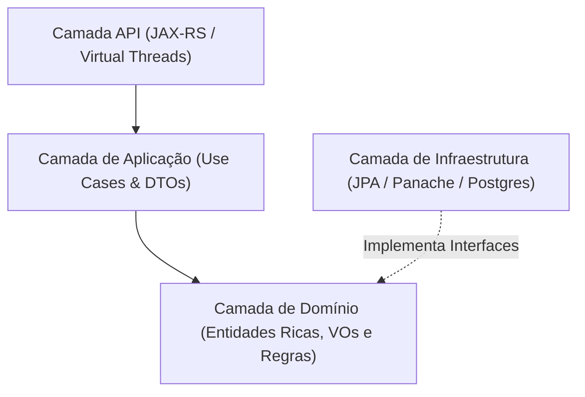

# 🛒 Mercado API

> Backend moderno e robusto para **Ponto de Venda (PDV) e Gestão de Mercados**, construído com **Java 21**, **Quarkus 3** e **Clean Architecture**.


---

## 📌 Visão Geral

O **Mercado API** foi desenvolvido com foco em alta performance, desacoplamento e regras de negócio sólidas. Utiliza as **Virtual Threads do Java 21** para atender a alto volume de requisições concorrentes e conta com isolamento **Multi-tenant**, permitindo que diferentes mercados/lojas compartilhem a mesma infraestrutura com total segregação de dados.

---

## 🚀 Funcionalidades Principais

* **Multi-tenancy Nativo:** Isolamento de todas as consultas e operações por loja via cabeçalho `X-Tenant-Id`.
* **Registro de Vendas:**
  * Suporte a pagamentos em `DINHEIRO`, `PIX`, `CARTÃO` e `FIADO`.
  * Cálculo automático de troco e validação de valor recebido.
  * Atualização atômica da gaveta de dinheiro do operador do caixa.
* **Gestão e Amortização de Fiado:**
  * Cadastro e consulta de clientes com saldo devedor.
  * Controle de limite de crédito individual.
  * Amortização parcial ou total da dívida com entrada automática no caixa aberto caso paga em dinheiro.
* **Controle de Caixa:**
  * Abertura, fechamento, saldo em espécie e sangria com validação de status de operação.
* **Alta Concorrência:**
  * Execução dos endpoints REST sobre **Java 21 Virtual Threads** (`@RunOnVirtualThread`).
* **Migrations com Flyway:**
  * Versionamento automatizado do schema do banco e dados de teste (seeds).

---

## 🏛️ Arquitetura do Projeto

O sistema adota os princípios da **Clean Architecture** e **Domain-Driven Design (DDD)**:



### Estrutura de Pacotes

```text
com.mercado
├── domain/                      # Núcleo da aplicação (puro, sem frameworks)
│   ├── entity/                  # Entidades ricas: Caixa, Cliente, Venda, Enums
│   ├── valueobject/             # Value Objects imutáveis: Dinheiro, TenantId
│   ├── repository/              # Portas / Interfaces puras de persistência (DIP)
│   └── exception/               # Exceções de negócio (DomainException)
├── application/                 # Orquestração das regras de negócio
│   ├── usecase/                 # Casos de uso: RegistrarVenda, AmortizarFiado, etc.
│   └── dto/                     # DTOs de entrada e saída desacoplados de HTTP
├── infrastructure/              # Implementações técnicas e persistência
│   └── persistence/
│       ├── entity/              # Entidades JPA (Panache) mapeadas no PostgreSQL
│       └── repository/          # Adapters que implementam os repositórios do domínio
└── api/                         # Porta de entrada REST
    ├── resource/                # Endpoints JAX-RS (VendaResource, ClienteResource)
    ├── dto/                     # Payloads JSON de Request e Response
    └── handler/                 # Tratamento global de exceções (DomainExceptionHandler)
```

---

## 🛠️ Tecnologias Utilizadas

| Tecnologia | Finalidade |
| :--- | :--- |
| **Java 21** | Plataforma com suporte nativo a Virtual Threads e Records |
| **Quarkus 3** | Framework Java supersônico e subatômico para microsserviços |
| **Hibernate Panache** | Camada de persistência otimizada sobre JPA/Hibernate |
| **PostgreSQL 16** | Banco de dados relacional robusto com extensões UUID |
| **Flyway** | Versionamento e migração automatizada do banco |
| **Docker & Docker Compose** | Orquestração do ambiente do banco de dados |
| **JUnit 5** | Testes unitários com fakes desacoplados do banco |

---

## ⚙️ Como Executar

### Pré-requisitos
* **Java 21** (JDK 21+) instalado e configurado no `PATH`
* **Docker** e **Docker Compose** instalados
* **Git**

---

### 1. Clonar o Repositório

```bash
git clone https://github.com/SEU_USUARIO/mercado-api.git
cd mercado-api
```

---

### 2. Subir o Banco de Dados

Suba a instância do PostgreSQL via Docker Compose:

```bash
docker compose up -d
```

> **Configurações padrão:**
> * Porta mapeada: `5433` (evita conflito com PostgreSQL local na 5432)
> * Banco: `mercado_db`
> * Usuário: `postgres` / Senha: `postgrespassword`

---

### 3. Rodar a Aplicação em Modo de Desenvolvimento

O Quarkus possui suporte a **Live Reload** instantâneo:

```bash
# Windows
.\gradlew.bat quarkusDev

# Linux / macOS
./gradlew quarkusDev
```

A API estará disponível em: `http://localhost:8080`  
Quarkus Dev UI disponível em: `http://localhost:8080/q/dev/`

---

### 4. Executar a Suíte de Testes

```bash
.\gradlew.bat test
```

---

## 📖 Endpoints da API

> 💡 **Importante:** Todas as requisições exigem o envio do cabeçalho de inquilino:  
> **`X-Tenant-Id: 00000000-0000-0000-0000-000000000001`** (UUID inserido no seed inicial).

---

### 1. Registrar Nova Venda

* **Rota:** `POST /api/vendas`
* **Headers:** `Content-Type: application/json`, `X-Tenant-Id: <UUID>`

#### Exemplo 1: Venda em Dinheiro (com cálculo de troco)
```json
{
  "valorTotal": 35.50,
  "valorRecebido": 50.00,
  "formaPagamento": "DINHEIRO",
  "descricao": "Venda no balcão"
}
```
**Resposta (201 Created):**
```json
{
  "vendaId": "b18b6e6c-7f5b-4395-bf43-6ffbb39cb452",
  "valorTotal": 35.50,
  "troco": 14.50,
  "saldoDevedorCliente": null
}
```

#### Exemplo 2: Venda Fiado
```json
{
  "valorTotal": 82.00,
  "formaPagamento": "FIADO",
  "nomeCliente": "Seu Zé da Esquina",
  "telefoneCliente": "11999998888",
  "descricao": "Compra fiado mensal"
}
```
**Resposta (201 Created):**
```json
{
  "vendaId": "4c6a9a08-a579-43c2-843a-7bc9b68ad932",
  "valorTotal": 82.00,
  "troco": 0.00,
  "saldoDevedorCliente": 82.00
}
```

---

### 2. Listar Clientes em Aberto (Fiado)

* **Rota:** `GET /api/clientes`
* **Query Params (opcional):** `?busca=Zé`
* **Headers:** `X-Tenant-Id: <UUID>`

**Resposta (200 OK):**
```json
[
  {
    "id": "7d9b9c9f-3d60-4966-9eb5-51a87e5898ef",
    "nome": "Seu Zé da Esquina",
    "telefone": "11999998888",
    "limiteCredito": 0.00,
    "saldoDevedor": 82.00
  }
]
```

---

### 3. Amortizar Dívida de Fiado

* **Rota:** `POST /api/clientes/{id}/amortizacoes`
* **Headers:** `Content-Type: application/json`, `X-Tenant-Id: <UUID>`

**Corpo da Requisição:**
```json
{
  "valorPago": 50.00,
  "formaPagamento": "DINHEIRO"
}
```

**Resposta (200 OK):**
```json
{
  "clienteId": "7d9b9c9f-3d60-4966-9eb5-51a87e5898ef",
  "valorPago": 50.00,
  "novoSaldoDevedor": 32.00
}
```

---

## 🔒 Tratamento Padronizado de Erros

A API retorna respostas estruturadas de erro via [`DomainExceptionHandler`](file:///C:/Projetos%20pessoais/mercado/mercado-api/src/main/java/com/mercado/api/handler/DomainExceptionHandler.java):

```json
{
  "erro": "Regra de Negócio Violada",
  "mensagem": "Valor para amortização (100.00) é superior ao saldo devedor atual (32.00).",
  "status": 422,
  "timestamp": "2026-09-05T19:55:00"
}
```

| Código HTTP | Significado |
| :--- | :--- |
| **`400 Bad Request`** | Parâmetro inválido, UUID mal formatado ou cabeçalho ausente |
| **`404 Not Found`** | Recurso (cliente, venda ou caixa) não encontrado |
| **`422 Unprocessable Entity`** | Violação de regra de negócio do domínio |
| **`500 Internal Server Error`** | Erro inesperado não mapeado |

---

## 📄 Licença

Este projeto está sob a licença [MIT](LICENSE).
